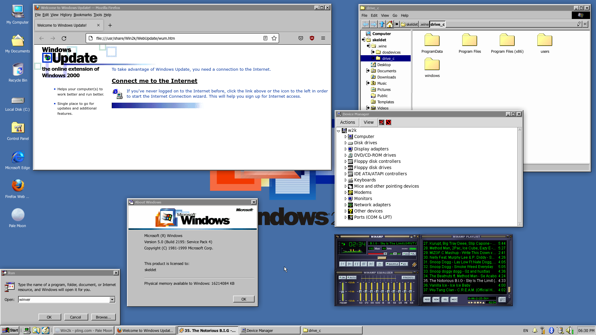
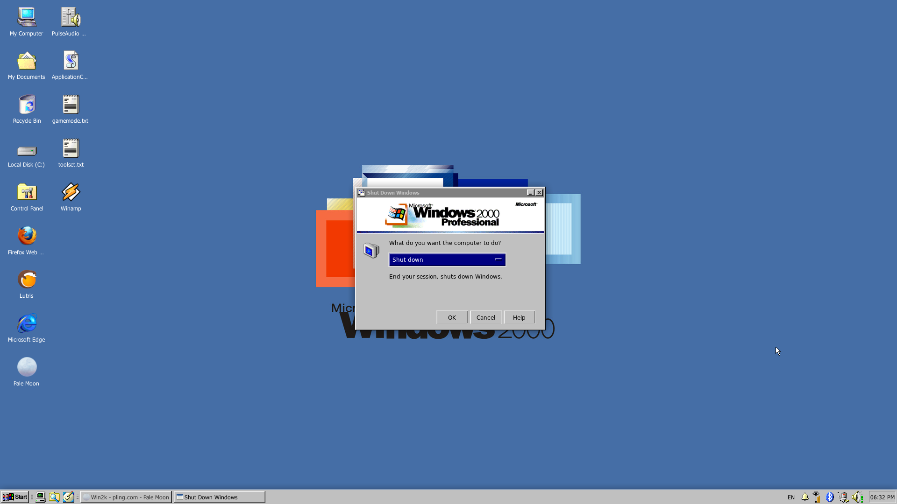

[🇪🇸 Español](README.es.md)

<div align="center">
  <br/>
  

# Win2k Undead

**復活 · The Windows 2000 desktop, brought back from the dead for XFCE on any distro.**

<br/>


<br/>

*Appearance only · no bundled packages · survives system updates · uninstalls cleanly*

*Tested on Arch; on the other distros the installer is still to be confirmed.*

<br/>


<br/><br/>


</div>

---

> [!NOTE]
> This is a fork of the **Win2k** theme for XFCE, which is itself a reinterpretation of **Chicago95**. The artwork is theirs. What changes here is the installer: a single one, native to each distro, that touches nothing in the system and can be reverted with one command.

<br/>

## 🖥️ What it is

Win2k Undead turns an XFCE desktop into a convincing Windows 2000: a GTK2/GTK3/xfwm4 window theme, icons, cursors, the Windows fonts with Tahoma as the UI font, event sounds, wallpapers, the classic taskbar with a Start menu, the usual desktop icons, and even a terminal that looks like `cmd`.

The original project did all of that with patched `.deb` packages, purging Mint packages and overwriting `os-release`; it only worked on Debian and Mint with XFCE 4.12 to 4.16. This fork throws all of that away and keeps what matters:

| 📦 Original `Win2k` | 🧟 Win2k Undead |
| --- | --- |
| `dpkg`/`apt` with 1.8 GB of bundled `.deb` files | **None.** Visual assets only; the few optional dependencies come from **your** package manager |
| Overwrote `/usr/lib/os-release` and `/etc/lsb-release` | **Left untouched.** A system update breaks nothing |
| Purged Mint packages and installed system `.deb` files | **Purges and replaces nothing** |
| Debian and Mint, XFCE 4.12 to 4.16 ("4.18 not supported") | **Arch, Debian, Ubuntu, Mint, Fedora, Void and openSUSE** with XFCE 4.18 and 4.20 |
| Fake `cmd` and `taskmgr`, Wine, IE, WMP10, games | **Gone.** Appearance only |
| English and Greek | **English and Spanish**, based on your session language |

<br/>

## 🎁 What's included

- 🪟 **`Win2K`** window theme for GTK3, GTK2 and xfwm4, plus the **`Win2K_NoLabel`** variant for the taskbar
- 🖱️ **`Win2k`** icon theme and **`Win2K_Cursor`** cursor theme, with Adwaita as a fallback so nothing is left blank
- 🔤 The Windows fonts: **Tahoma 9** in the interface, Tahoma Bold 8 in window titles, PxPlus IBM VGA in the terminal
- 🔊 **`Win2k`** event sound theme: startup, shutdown, error, recycle bin
- 🏞️ Windows 2000 wallpapers, including the classic blue
- 🧭 **Taskbar** with Start menu, Explorer shortcut, window list, tray with network and volume, and clock
- 🗂️ Desktop icons: *My Computer, My Documents, Recycle Bin, Local Disk (C:), Control Panel, My Network Places*, linked to the real Thunar, trash and settings
- ⌨️ **Command Prompt**: bash with a `C:\Users\you>` prompt, the Windows 2000 banner and xfce4-terminal in black with a DOS font

<br/>

## 🐧 Distros

The installer reads `/etc/os-release`, picks the package manager and uses it only for three or four optional packages. Everything else is files under `/usr/share` and `xfconf` settings, identical on any distro.

| Distro | Manager | What it installs if missing |
| --- | --- | --- |
| Arch, Manjaro, EndeavourOS, Artix, CachyOS | `pacman` | `xfce4-pulseaudio-plugin`, `adwaita-icon-theme`, `fontconfig`, `gtk-update-icon-cache`, `network-manager-applet` |
| Debian, Ubuntu, Linux Mint, Pop!_OS, Zorin, elementary | `apt` | `xfce4-pulseaudio-plugin`, `adwaita-icon-theme`, `fontconfig`, `gtk-update-icon-cache`, `network-manager-gnome` |
| Fedora, Nobara, RHEL and derivatives | `dnf` | `xfce4-pulseaudio-plugin`, `adwaita-icon-theme`, `fontconfig`, `gtk-update-icon-cache`, `network-manager-applet` |
| Void Linux | `xbps` | `xfce4-pulseaudio-plugin`, `adwaita-icon-theme`, `fontconfig`, `gtk-update-icon-cache`, `network-manager-applet` |
| openSUSE Tumbleweed and Leap | `zypper` | `xfce4-panel-plugin-pulseaudio`, `adwaita-icon-theme`, `fontconfig`, `gtk3-tools`, `NetworkManager-applet` |

The network applet is only installed if NetworkManager is in use; if your system uses something else, nothing sneaks in. On a distro that is not on the list the theme installs all the same and only that step is skipped.

<br/>

## 📲 Installation

You need XFCE already installed (your distro's `xfce4` group) and a session open in it.

```bash
git clone https://github.com/Chidaruma696/Win2k_undead.git
cd Win2k_undead
chmod +x install.sh uninstall.sh
./install.sh
```

Run it as your normal user. It asks for `sudo` for two things only: installing those optional packages and copying the assets to `/usr/share`. The theme, font and icons are applied live; log out and back in so the taskbar and the prompt come out perfect.

| Option | Effect |
| --- | --- |
| `--no-deps` | Installs nothing with the package manager |
| `--no-panel` | Keeps your current taskbar instead of replacing it |
| `--no-cmd` | Keeps your terminal and your bash prompt |
| `--help` | Shows the help |

### Uninstall

```bash
./uninstall.sh
```

Removes the assets from `/usr/share`, the desktop icons, the CSS block and the prompt block, restores the default XFCE panel and sets the theme back to Adwaita. It only deletes what this project created; the packages it installed stay, because they are regular packages from your distro. Your previous configuration is saved in `~/.config/win2k_undead` in case you want to look it up.

<br/>

## 🔧 How it works

```
Win2k_undead/
├── install.sh           Detects the distro, copies assets to /usr/share and configures your user
├── uninstall.sh         Reverts all of the above
└── assets/
    ├── themes/Win2K/     GTK2 / GTK3 / xfwm4 theme
    ├── icons/            Win2k and Win2K_Cursor (tarballs, extracted at install time)
    ├── fonts/            Windows fonts
    ├── sounds/Win2k/     Sound theme
    ├── backgrounds/      Wallpapers
    ├── panel/            Taskbar layout (xfconf XML)
    ├── cmd/              terminalrc and the C:\> prompt for bash
    ├── nolabel/          Win2K_NoLabel variant
    ├── xfconf/           Reference XML for the XFCE channels
    └── gtk-menu.css      Menu styling merged into the theme
```

The installer does three things, in this order:

1. **Optional dependencies** with your distro's package manager. Nothing destructive: just the volume plugin, Adwaita as the icon fallback and, if applicable, the network applet.
2. **System assets** under `/usr/share`: theme, icons, cursors, fonts, sounds and wallpapers. Along the way it fixes the icons' `index.theme`, which pointed to nonexistent themes and left the tray full of broken squares.
3. **Your user**, without `sudo`: writes the taskbar XML with the panel and `xfconfd` stopped so nothing overwrites it, applies theme, font, cursor and sounds with `xfconf-query`, creates the bilingual desktop icons, adds to `~/.config/gtk-3.0/gtk.css` the block that fixes icon labels on XFCE 4.18 and 4.20, installs the `cmd` look and restarts `xfsettingsd` so everything shows up instantly.

Everything it touches in your home folder goes between markers (`>>> win2k_undead ... <<<`), so the uninstaller removes exactly that and leaves the rest of your `gtk.css` and your `.bashrc` as they were.

<br/>

## ❓ Notes

- **No sounds?** Settings ▸ Appearance ▸ Settings, sound theme `Win2k`, and turn up the *System sounds* volume.
- **Blank tray icons?** `adwaita-icon-theme` is missing. The installer warns you and tells you the exact command for your distro.
- **Weird icon labels on 4.20?** The `gtk.css` block forces the Windows 2000 blue selection with white text. You can change the colors there.
- **Compositor?** Not needed, and the Win2k look disables it. If you want it, enable it in Window Manager Tweaks.
- **A different panel?** Install with `--no-panel`. The reference XML stays in `assets/panel` in case you want to copy just parts of it.
- **Void without systemd?** It works: NetworkManager detection looks at the process, not `systemctl`.

<br/>

## 🙏 Credits and license

- The artwork and sounds belong to the **Win2k** project by et0ndyy, built on **Chicago95** by Grassmunk, AdrianoML and EMH-Mark-I.
- This fork only rewrites the installer for modern XFCE and several distros; the visual assets are unchanged.
- **[GPL-3.0](LICENSE)** license, the same as the original project. The bundled Windows fonts keep their own terms.

<br/>

<div align="center">

*It's now safe to turn off your computer.*

復活 · ふっかつ

</div>
